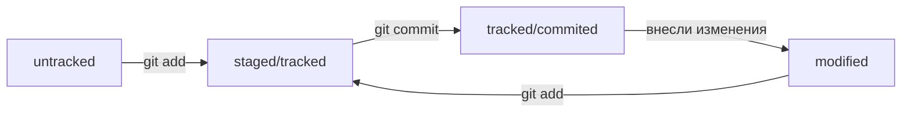

# Подсказки по работе с Git
---
* **После внесения новых поправок необходимо подготовить файлы к сохранению(фиксации) для этого используем команду "git add" с указанием файла** 

* **После того, как вы подготовили файл, необходимо его зафиксировать(закоммитить). Для этого используем команду "git commit -m" и далее в ковычках пишем комментарий к коммиту** 

* **ХЭШ коммита - это отпечаток коммита. Он представлен в виде символов и цифр, которые вместе являются идентификатором коммита. По нему можно обращаться к коммиту и передавать в качестве параметра командам работы с git**

* **Файл HEAD находится в папке .git и содержит в себе ссылку на последний коммит(голова). HEAD можно использовать как ключевое слово, обозначающее последний коммит, в качестве параметра в командаз работы с git**

* **При помощи команды git log можно посмотреть все коммиты, где будет указан ХЭШ, почта и имя создателя коммита, дата и тд. Так же можно использовать команду git log --oneline, которая покажет сокращенную версию истории коммитов**

* **Cтатусы файлов:**

