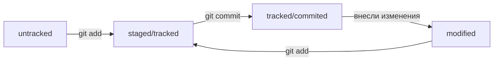

# Подсказки по работе с Git
---
* **После внесения новых поправок необходимо подготовить файлы к сохранению(фиксации) для этого используем команду "git add" с указанием файла** 

* **После того, как вы подготовили файл, необходимо его зафиксировать(закоммитить). Для этого используем команду "git commit -m" и далее в ковычках пишем комментарий к коммиту** 

* **ХЭШ коммита - это отпечаток коммита. Он представлен в виде символов и цифр, которые вместе являются идентификатором коммита. По нему можно обращаться к коммиту и передавать в качестве параметра командам работы с git**

* **Файл HEAD находится в папке .git и содержит в себе ссылку на последний коммит(голова). HEAD можно использовать как ключевое слово, обозначающее последний коммит, в качестве параметра в командаз работы с git**

* **При помощи команды git log можно посмотреть все коммиты, где будет указан ХЭШ, почта и имя создателя коммита, дата и тд. Так же можно использовать команду git log --oneline, которая покажет сокращенную версию истории коммитов**

* **Cтатусы файлов:**

* **Обычно требуется от 30 до 72 символов в сообщениях к коммитам, чтобы они не были слишком большими. Они должны быть екраткими и содержательными. Как правило, при написании коммитов на русском языке используются инфинитивы - "Добавить кнопку запуска". При написании коммитов на английском языке используется повелительное наклонение - "Add start bottom".** 

* **Корпоративный стиль сообщения коммита - "LGS-239: Дополнить список пасхалок новыми числами". Здесь вначале используется идентификатор задачи проекта**

* **Conventional Commits - <тип>: <сообщение>. Тип - конкретное ключевое слово, обозначающее тип изменения. Пример: fix - устранить. "fix: исправить подсчёт суммы заказов за неделю". Подробнее все команды модно посмотреть на сайте по ссылке: https://www.conventionalcommits.org/ru/v1.0.0-beta.4/#спецификация**

* **GitHub-cтиль. GitHub можно использовать не только для хранения файлов проекта, но и для ведения списка задач (англ. issue) этого проекта. Если коммит «закрывает» или «решает» какую-то задачу, то в его сообщении удобно указывать ссылку на неё. Для этого в любом месте сообщения нужно указать #<номер задачи>. Например, вот так.git commit -m "Исправить #334, добавить график температуры"**

